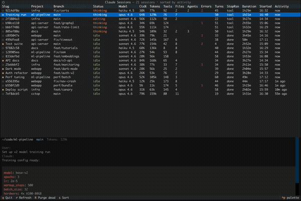

# cctop


Like `htop`, but for [Claude Code](https://docs.anthropic.com/en/docs/claude-code). A live terminal dashboard that shows all your sessions at a glance, status, context usage, tokens, and latest messages.



## Install

Requires [Claude Code](https://docs.anthropic.com/en/docs/claude-code), [uv](https://docs.astral.sh/uv/), and [jq](https://jqlang.github.io/jq/).

```bash
curl -fsSL https://raw.githubusercontent.com/DeanLa/cctop/main/install.sh | bash
```

Then launch from any terminal:

```bash
cctop
```

## Why

If you're past the "one session at a time" stage but not running a fleet of headless agents, you're in the middle ground where most tools don't help. You have 4-20 sessions open across multiple projects, refactoring one repo while tests run in another, firing off a prompt in a third while waiting for a fourth to finish. You context-switch constantly, lose track of which tab is blocked on you, and forget what that session in the background was even doing.

cctop gives you one screen to see all of them.

## What You See

### Keybindings

| Key | Action |
|-----|--------|
| `q` | Quit |
| `r` | Force refresh |
| `R` | Purge dead sessions (PID check + staleness fallback) |
| `s` | Open sort picker (activity, name, status, duration, turns, tokens, tools, files, agents, errors) |
| `ctrl+p` | Open command palette (switch theme, etc.) |

### Columns

| Column | What it shows |
|--------|---------------|
| **Name** | Session display name (custom title or directory slug) |
| **Project** | Working directory name |
| **Branch** | Git branch (truncated to 20 chars) |
| **Status** | Granular activity status (see below) |
| **Model** | Model family and version (e.g. "sonnet 4.6", "opus 4.6") |
| **Ctx%** | Context window usage percentage |
| **Tokens** | Total tokens consumed (e.g. "145k") |
| **Tools** | Tool call count |
| **Files** | Number of files edited |
| **Agents** | Running subagents |
| **Errors** | Error count (highlighted in red) |
| **Turns** | Conversation turn count (user-assistant exchanges) |
| **StopRsn** | Last stop reason (done, tool, limit) |
| **Duration** | Elapsed time since session start (e.g. "1h23m") |
| **Started** | Session start time (e.g. "14:30") |
| **Activity** | Time since last event (e.g. "2m ago") |

Highlight any row to see a detail panel with the full working directory, git branch, token breakdown, files edited, subagent and error counts, the last user prompt, and Claude's last response.

### Status Labels

The Status column shows what each session is doing right now:

| Status | Color | Meaning |
|--------|-------|---------|
| idle | green | Waiting, no action needed |
| awaiting plan | blue | Plan ready for your review |
| needs input | orange | Blocked on a question from Claude |
| awaiting permission | orange | Waiting for you to approve a tool use |
| thinking | yellow | Claude is generating a response |
| planning | blue | Session is in plan mode (reading/searching for the plan) |
| editing | orange | Writing or editing files |
| running cmd | green | Executing a shell command |
| searching | cyan | Searching files (Glob/Grep) |
| reading | cyan | Reading files |
| searching web | magenta | Web search or fetch |
| subagent | purple | Running a subagent |
| reviewing | purple | Running a code review subagent |
| researching | purple | Running an explore/research subagent |
| mcp:*server* | magenta | Using an MCP tool (e.g. mcp:atlassian) |
| error: *type* | red | Hit an error (rate limit, auth failed, etc.) |
| stale | dim | No activity for 1+ hour |

### Session Lifecycle

Sessions that go quiet for 1+ hour are marked stale. Sessions that end clean up after themselves. Sessions whose Claude process has exited (e.g. Ctrl+C) are automatically removed by the background poller via PID checks. Press `R` to manually purge dead sessions, or run `cctop --reset` to wipe all session data and start fresh.

A health check bar may appear at the bottom of the dashboard when cctop detects a mismatch between tracked sessions and running Claude processes. This is normal if you had sessions running before installing cctop.

### Configuration

cctop stores settings in `~/.cctop/config.toml`. Currently supported:

```toml
[ui]
theme = "textual-dark"   # any Textual built-in theme
```

Theme changes via the command palette (`ctrl+p`) are automatically saved and restored on next launch. The `--reset` flag clears session data but preserves your config.

## Troubleshooting

**No sessions appear after install**
- Make sure `jq` is installed (`jq --version`). The hook requires it and silently does nothing without it.
- Only sessions started *after* installing cctop are tracked. Existing sessions won't appear until they are restarted.
- Try running `cctop --reset` to clear stale data and start fresh.

**Orange warning bar at the bottom**
- "N sessions not tracked" means Claude processes are running that cctop doesn't know about. This is expected for sessions that started before cctop was installed.
- "N stale sessions detected" means tracked sessions whose process has exited. Press `R` to purge them.

## Uninstall

Remove the plugin and CLI entry point:

```bash
rm -rf ~/.claude/plugins/cache/cctop
rm -f ~/.local/bin/cctop
rm -rf ~/.cctop
```

## Contributing

Contributions welcome! See [CONTRIBUTING.md](CONTRIBUTING.md) for development setup, architecture, and testing.

## License

[MIT](LICENSE)
